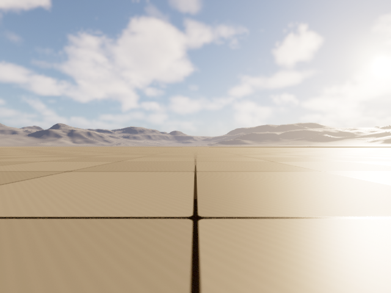
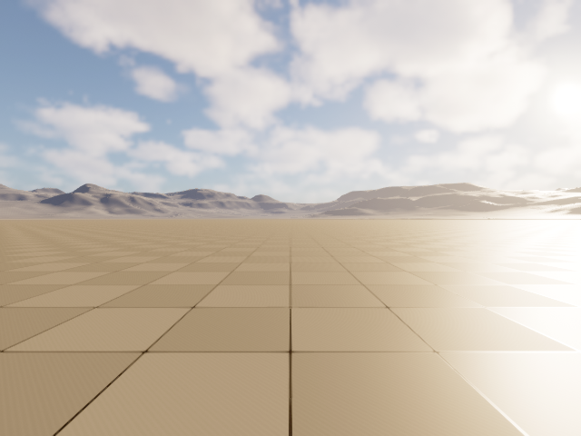
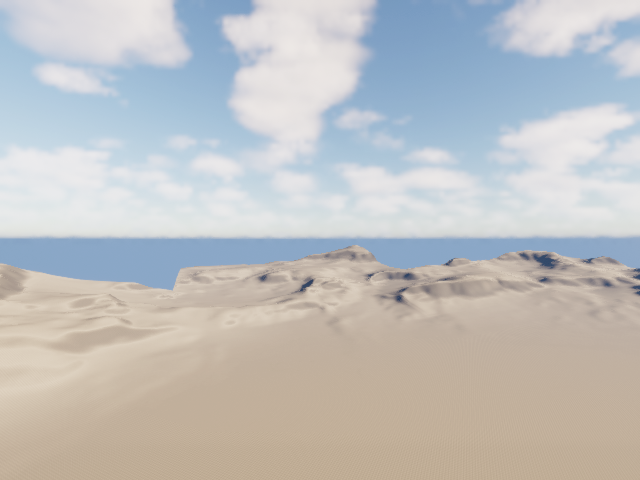
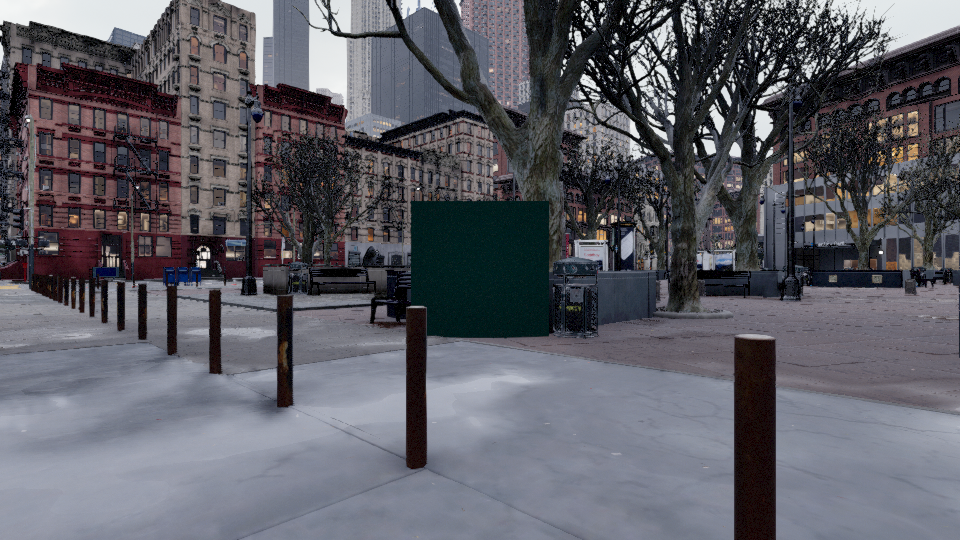
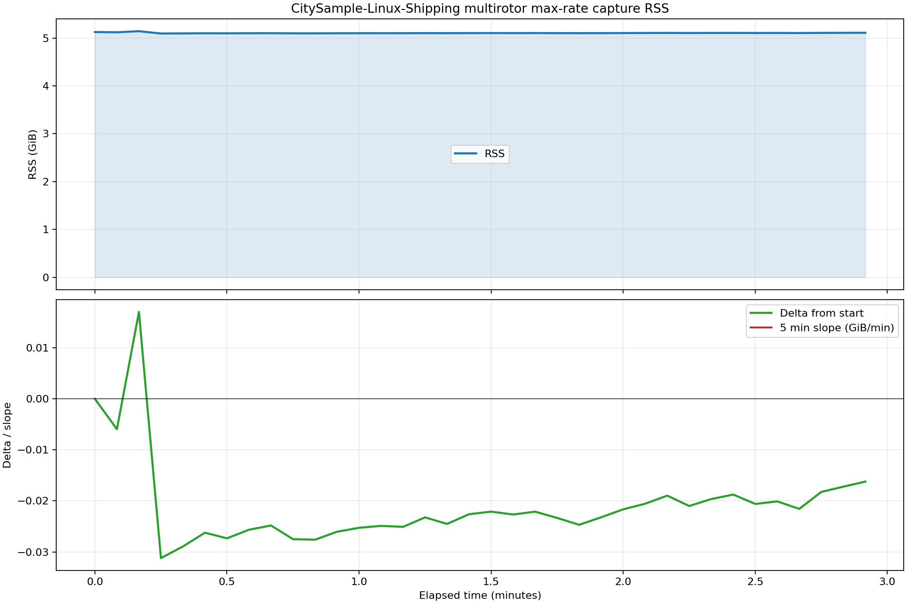

# 在 UE5.7 上重做一个可用的 AirSim 仿真器：稳定渲染、实时控制、CV 模式与可复用插件

最近这段时间，我们把一套基于 Unreal Engine 5.7 的 AirSim 仿真链路从“能跑”重新打磨到了“可用”。

这次工作的目标并不是再做一个演示 Demo，而是解决几个真正会卡住研究和工程落地的问题：

- 长时间持续渲染时，RSS 不能失控增长
- 相机图像质量要正常，不能发黑、泛白或者带意料之外的后处理
- `Multirotor` 和 `ComputerVision` 两种模式都要可用
- 不仅能在当前城市工程里运行，还要能迁移到新的空项目里
- 最终要整理成一个可复用的仓库，而不是散落在本地工作区中的脚本和补丁

现在，这套结果已经整理到了公开仓库：

- `https://github.com/Shadow-Dream/AirSim-Ubuntu-UE5.7`

---

## 这次到底做成了什么

简单说，当前版本已经同时具备以下能力：

1. 在 Linux + UE5.7 环境下稳定运行 AirSim
2. `Multirotor` 模式下可持续抓图并进行飞控
3. `ComputerVision` 模式下可高频切位姿并正确刷新图像
4. 支持通过配置文件设置相机相对无人机的位姿与相机参数
5. 支持在场景中通过 AirSim 风格 API 增删无碰撞、无光照的 label 立方体
6. 支持将插件与 Python 包拆出来，在新的 Unreal 工程中复用

仓库本身也已经整理为一个“发布总仓”：

- 根目录可直接 `pip install git+...`
- `Unreal/Plugins/AirSim` 可以直接复制到你的 Unreal 项目中
- `examples/settings` 提供了可直接使用的 smoke 配置和低画质配置
- `docs/` 里包含接入说明、API 说明和验证总结

---

## 真实运行截图

### 1. 清洁项目中的多旋翼模式

下面这张图不是在原始 CitySample 工程里拍的，而是在一个全新的 smoke project 中抓取的，用来验证这套 AirSim 插件并不依赖原始城市场景本身。



起飞之后的视角如下，可以看到图像是实时变化的，而不是静态相机或历史帧：


### 2. 清洁项目中的 ComputerVision 模式

这是 `ComputerVision` 模式的初始视角：



切换到新的位姿之后，图像内容发生了明显变化，说明 `simSetVehiclePose` 后拿到的不是旧帧复用结果：



### 3. 显式场景刷新后的 label 可视化

我们额外加了 label API，用于路径点、目标点、调试标记等可视化任务。  
下面这张图展示了在 `ComputerVision` 视角中，通过显式 `simNotifyImageCapturesSceneChanged()` 之后刷新出来的 label：



### 4. 持续抓图时的 RSS 曲线

另一个关键点是稳定性。  
我们对高压持续抓图场景做了监控，下面是运行过程中的 RSS 曲线：



这张图对应的是当前验证通过的发布链路，至少说明一件事：这套方案已经不是“拍几张图没问题，一持续跑就爆”的状态。

---

## 这次最难的不是功能，而是边界条件

如果只追求“能抓到图”，AirSim 在 UE5 上并不是完全跑不起来。  
真正困难的是下面这些边界条件要同时成立：

- 抓图持续进行时，内存不能越跑越涨
- 为了抑制内存问题，不能把画面修成黑图
- 为了修黑图，不能再引入过曝、泛白、雾蒙蒙的观感
- `ComputerVision` 模式不能只是位姿数值变化，图像却不刷新
- label 这种场景编辑行为，不能破坏现有图像链路

也就是说，这不是一个单点 bug，而是一组相互耦合的问题。

我们最后采用的思路，不是继续靠“局部补丁”硬顶，而是把问题拆成四个层面分别收敛：

### 1. 渲染链路稳定性

核心目标是：

- 持续抓图时 RSS 保持受控
- 避免重新引入历史上的无界增长路径

### 2. 图像质量一致性

核心目标是：

- 不黑
- 不过曝
- 无意图之外的滤镜
- 与预期视角保持一致

### 3. CV 模式的新鲜帧语义

核心目标是：

- 位姿更新之后，下一张图应该真的是新视角对应的图
- 不能出现“位姿已经变了，返回的还是上一帧”的情况

### 4. 可发布与可复用

核心目标是：

- Python 接口包可直接安装
- Unreal 插件可直接拷贝复用
- 文档和示例配置齐全

---

## 除了修仿真，我们还做了两个很实用的小扩展

### 相机参数可配置

除了 AirSim 原生支持的相机相对位姿配置之外，这次还把一些常用相机参数一起开放到配置层：

- `X/Y/Z/Pitch/Roll/Yaw`
- `CaptureSettings`
- 额外支持 `CineCameraSettings`

这意味着你可以直接在配置文件里控制：

- 相机挂载位置
- 焦距
- 对焦距离
- 光圈
- 以及部分 filmback / lens 参数

对于做视觉导航、视角复现实验和多相机数据采集都很实用。

### Label API

我们还加入了一套轻量级、AirSim 风格的场景标记接口：

- `simAddLabel(pose, size, color_rgba)`
- `simDestroyLabel(label_id)`
- `simDestroyAllLabels()`
- `simNotifyImageCapturesSceneChanged()`

这套 API 的用处很直接：

- 可视化路径点
- 标记候选目标
- 标注关键位置
- 做算法调试时直接把抽象结果投到场景里

而且这次特意把“场景变化”和“图像刷新”解耦了。  
也就是说，label 的增删不会偷偷改变抓图逻辑；如果客户端确实需要下一张图立刻反映场景更新，就显式调用 `simNotifyImageCapturesSceneChanged()`。

这比把隐式副作用埋进仿真器内部更可控，也更符合工程预期。

---

## 一个很重要的结论：AirSim 与场景本身是可以解耦的

这次我自己最满意的一点，不是修好了某个具体 bug，而是把“能否迁移复用”这件事做了真实验证。

我们没有停留在“理论上应该可以”，而是实际新建了一个干净 Unreal 项目，做了如下验证：

- 拷贝插件
- 设置通用 `AirSimGameMode`
- 使用 UE 自带 `OpenWorld` 作为 smoke map
- 分别启动 `Multirotor` 与 `ComputerVision`
- 实测 RPC、抓图、位姿控制和图像刷新

结论是：

- 这套 AirSim 运行时和渲染链路并不硬绑定于当前城市关卡
- 但这不意味着“任何场景零配置直接可用”

更准确的说法是：

> 插件本身是可复用的，但每个新场景仍然需要你自己保证出生点、碰撞环境和相机视野是合理的。

这是一个更工程化、也更诚实的结论。

---

## 现在这个仓库适合谁

如果你符合下面任一类需求，这个仓库应该是有用的：

- 你想在 UE5.7 上继续使用 AirSim
- 你需要一个可以持续抓图的无人机仿真器
- 你需要 `ComputerVision` 模式下稳定切位姿并采图
- 你希望在自己的场景中复用 AirSim 插件，而不是被某个特定地图绑死
- 你希望一边保留 Unreal 插件，一边还能直接 `pip install` Python 客户端

---

## 如何开始

最短路径如下：

### 安装 Python 客户端

```bash
pip install "git+https://github.com/Shadow-Dream/AirSim-Ubuntu-UE5.7.git"
```

### 复制 Unreal 插件

把下面这个目录复制到你的 Unreal 项目：

```text
Unreal/Plugins/AirSim
```

### 优先使用 smoke 配置先跑通

仓库里已经带了两份更适合首轮验证的配置：

- `examples/settings/smoke.multirotor.json`
- `examples/settings/smoke.computervision.json`

建议先在：

- `/Engine/Maps/Templates/OpenWorld.OpenWorld`

上验证，而不是一开始就上复杂场景。

---

## 最后

对我来说，这个项目最有价值的地方不只是“把 AirSim 搬到了 UE5.7”，而是把它从一个容易在边界条件下失效的实验环境，重新整理成了一个：

- 可运行
- 可调试
- 可持续渲染
- 可复用
- 可发布

的仿真器基座。

如果你也在做视觉导航、具身智能、无人机仿真或者合成数据采集，希望这套工程化整理过的版本能帮你少踩一些坑。

仓库地址：

- `https://github.com/Shadow-Dream/AirSim-Ubuntu-UE5.7`
